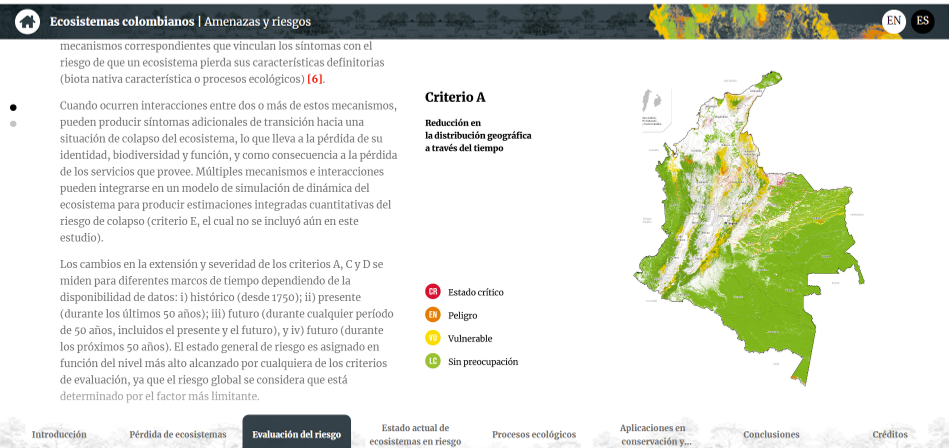

La idea, liderazgo y desarrollo de esta Serie de Talleres ha sido un esfuerzo de:

- <a href="https://www.edslab.org/" target="_blank">**Prof. Melissa Guzmán**</a> (University of Southern California).

- Juan Zuloaga director de ( <a href="https://www.ecodiversatropical.com/" target="_blank">Ecodiversa Tropical</a>).

- Así como de varixs colaboradorxs.


```{r setup, include=FALSE}
knitr::opts_chunk$set(echo = TRUE)
setwd("C:/Talleres_R/Intro_Motivacional")
```

# 1. Presentación

## ¿Qué queremos hacer?

Queremos ofercer la oportunidad de **desarrollar habilidades computacionales y analíticas** para el manejo y análisis de datos dirigidos a la conservación de la biodiversidad.

Desarrollaremos y comunicaremos de una manera clara la teoría y los conceptos que desde la ecología, evolución y otras disciplinas se han formulado para informar la práctica de la conservación.

El manejo y análisis de datos será parte fundamental de los talleres.

------------------------------------------------------------------------

{width="100%" height="100%"}

------------------------------------------------------------------------

## ¿A quiénes está dirigido?

-   Jóvenes en proceso de formación en la ciencia y la práctica de conservación de la biodiversidad (Universidades, ONGs, sociedad civil, etc).

-   Tomadores de decisiones en agencias del gobierno (nacionales, regionales y locales).

## ¿Qué es lo que ofrecemos?

Una serie de talleres que tengan como eje el análisis cuantitativo de datos, con base en la teoría y conceptos que se establece desde la ecología, la evolución y otras disciplinas, con el propósito de informar la práctica de la conservación de la biodiversidad.

Los talleres serán presentados en **Español**. Sí, hablamos Español!!!!

### Serie de talleres básicos

Los talleres básicos le darán la posibilidad de desarrollar las habilidades en el manejo de R y análisis de datos, con lo cual podrá aventurarse a adquirir un nivel intermedio y avanzado.

-   Introducción a R: conceptos básicos, operaciones y funciones básicas
-   Cargando y manejando datos en R que se encuentran en diferentes formatos.
-   Visualización de datos

### Serie de talleres avanzados

-   Modelamiento (ej: análisis estadístico)
-   Comunicación de resultados (ej: Markdown, Quarto, websites)
-   Colaboración y manejo de sus códigos (ej. GitHub, Git)

### Serie de talleres temáticos

Queremos ofrecer una serie de talleres temáticos que presenten la teoría, métodos aplicados y estudios de caso dirigidos a la conservación de la biodiversidad.

Esta es una lista temática preliminar de lo que queremos construir.

-   Introducción a la genética de la conservación

-   Análisis de tendencias de poblaciones para la conservación de la biodiversidad

-   Análisis espacial dirigido a la conservación de la biodiversidad

-   Teoría de la decisión para la planeación y manejo de la biodiversidad

## ¿Qué es lo que queremos construir?

Queremos promover una comunidad de científicos y practicantes en la conservación de la biodiversidad.

Para esto implementaremos una herramienta virtual colaborativa: **'EcoDiversaR'** (estén pendientes!), en donde usted podrá:

{width="50%" height="80%" align="right"}

------------------------------------------------------------------------

-   Hacer preguntas y/o encontrar respuestas relacionadas con análisis de datos aplicados a la conservación
-   Solucionar o depurar códigos
-   Desarrollar, comunicar y compartir evidencia científica y experiencias en conservación de la biodiversidad
-   Ofrecer oportunidades de colaboración para prevenir y/o resolver problemas relacionados con el deterioro y/o pérdida de la diversidad biológica en el neotrópico.
-   y mucho mas......
-   ¿Tiene sugerencias?
-   (contáctenos: [ecodiversatropical\@gmail.com](mailto:ecodiversatropical@gmail.com){.email})

------------------------------------------------------------------------

<br>

## ¿Quienes somos?

Somos un grupo de ecólogxs latinoamericanxs que compartimos un fuerte deseo y compromiso con la conservación de la biodiversidad neotropical.

El grupo está liderado por la <a href="https://www.edslab.org/" target="_blank">**Dra. Melissa Guzmán**</a> (Profesora Southern California University) y Juan Zuloaga director de ( <a href="https://www.ecodiversatropical.com/" target="_blank">Ecodiversa Tropical</a>).

Los invitamos a que sean parte de esta iniciativa!! (contáctenos: [ecodiversatropical\@gmail.com](mailto:ecodiversatropical@gmail.com){.email})

------------------------------------------------------------------------

Aquí algunxs de nuestrxs colaboradorxs:

{width="100%" height="200%"}

------------------------------------------------------------------------

<br>


## Ecodiversa Tropical

Ecodiversa Tropical es una iniciative Colombiana dedicada a la conservación de la biodiversidad. Dentro del programa de liderazgo queremos ofrecer oportunidades para el desarrollo investigativo y profesional encaminados a fortalecer las capacidades de nuestros investigadorxs y practicante de la conservación de la biodiversidad.

Por favor visite nuestra página web para mas detalles <a href="https://www.ecodiversatropical.com/" target="_blank">Ecodiversa Tropical</a>

------------------------------------------------------------------------

<a href="https://www.ecodiversatropical.com/"

target="_blank"></a>

------------------------------------------------------------------------

<br>

# 2. Contexto general y motivación

## 2.1. ¿Por qué es importante el desarrollo habilidades computacionales y análisis de datos?

Bueno, hay algunos hechos recientes que hacen necesario desarrollar estas habilidades. Por ejemplo:

### 2.1.1. Volumen de datos

El volumen de datos ha crecido exponencialmente en las últimas décadas y muy seguramente serguirá en ascenso (<a href="https://academic.oup.com/bioscience/article/68/8/563/5049569" target="_blank">Farley et al (2018)</a> y <a href="https://link.springer.com/article/10.1007/s10021-016-0075-y" target="_blank">LaDeau et al (2017)</a>).

Es lo que llaman ahora **big data** que ha servido para desarrollar muchas disciplinas dentro de la biología, por ejemplo: macroecología (<a href="https://kops.uni-konstanz.de/server/api/core/bitstreams/825d9ecd-2a96-4c92-b782-77ebc3462a2a/content" target="_blank">Wüest et al (2020)</a>), animal movement (<a href="https://www.science.org/doi/10.1126/science.abg1780" target="_blank">Nathan et al 2022</a>), solo por mencionar algunos.

Paralelemente se han implementado iniciativas para la compilación sistemática de datos y se han diseñado plataformas para hacer disponibles estas bases de datos.

Las bases de datos incluyen no solamente aspectos genéticos, biológicos y ecológicos de las especies, sino información física del paisaje y de los ecosistemas. Además, se encuentran datos espaciales y estadísticos de patrones sociales, económicos, culturales, geopolíticos y de presion humana.

Veamos algunos ejemplos que pueden ilustrar lo que se encuentra en la red:

#### Observaciones de especies

The Global Biodiversity Information Facility (<a href="https://www.gbif.org/" target="_blank">GBIF</a>) compila observaciones de especies alrededor del mundo.

Las bases de datos de GBIF han servido de insumo para identificar patrones de biodiversidad, evaluar hipótesis, identificar vacíos de información e informar políticas y estrategias globales de protección de la biodiversidad (ver por ejemplo <a href="https://www.pnas.org/doi/10.1073/pnas.2018093118" target="_blank">Heberlin et al 2021</a>).

La figura muestra el número de records que ha acumulado esta base de datos (a noviembre de 2021) y la distribución geográfica de observaciones de especies.

------------------------------------------------------------------------

<a href="https://biodiversidad.co/" target="_blank">{width="50%" height="100%" align="right"}</a> Observaciones de especies (en millones)

-   Global: 1,650
-   Bolivia: \~1.5
-   Colombia : \~ 11.5\
-   Ecuador: \~ 5.7
-   Perú: \~ 5.5
-   Fuente: <a href="https://www.gbif.org/" target="_blank">GBIF</a>

------------------------------------------------------------------------

<br>

#### Sistemas de biodiversidad nacionales

También existen estrategias nacionales, como el <a href="https://biodiversidad.co/" target="_blank">SiB</a> en Colombia, que es la red nacional de datos abiertos sobre biodiversidad.

<a href="https://biodiversidad.co/" target="_blank">{width="50%" height="100%"}</a>

<br>

#### Digitalización de colecciones biológicas y paleontológicas

<a href="https://www.idigbio.org/" target="_blank">iDigBio</a> es una iniciativa para digitalizar especímenes de las colecciones biológicas y paleontológicas de los museos de historia natural.

<a href="https://www.idigbio.org/" target="_blank">{width="50%" height="100%"}</a>

<br>

#### Registros botánicos

Botanical Information and Ecology Network <a href="https://bien.nceas.ucsb.edu/bien/" target="_blank">(BIEN)</a> documenta patrones globales de distribución, diversidad y funcionalidad en plantas.

<a href="https://bien.nceas.ucsb.edu/bien/" target="_blank">{width="50%" height="100%"}</a>

<br>

#### Imágenes de satélite

Los sensores remotos han generado un volumen de datos en formato raster de alta resolución de toda la superficie de la tierra.

Por ejemplo, en el amazonas se calcula que en el periodo entre 1995-2017 se pueden tener hasta 240,000 imágenes de satélite con una resolución de 30m (<a href="https://onlinelibrary.wiley.com/doi/10.1111/gcb.15029" target="_blank">Bullock et al, 2020</a>).

Hay varios portales en donde se encuentran disponibles imágenes de satélite o productos derivados de ellas.

Por ejemplo, <a href="https://earthexplorer.usgs.gov/" target="_blank">USGS Earth Explorer</a>.

<a href="https://earthexplorer.usgs.gov/" target="_blank">{width="50%" height="100%"}</a>

<br>

#### Productos derivados de imágenes de satélite

Algunos laboratorios alrededor del mundo e institutos de investiganción nacional han desarrollado productos a partir de las imágenes de satélite. Por ejemplo:

**Productividad de la cobertura vegetal** .

El Dynamic Habitat Index (DHI, por sus siglas en inglés) desarrollado por el <a href="http://silvis.forest.wisc.edu/data/dhis/" target="_blank">Silvis Lab, Univeristy of Wisconsin-Madison</a> proporciona información temporal de la productividad de la cobertura vegetal a nivel global.

<a href="http://silvis.forest.wisc.edu/data/dhis/" target="_blank">{width="50%" height="100%"}</a>

<br>

**Mapa de integridad de areas boscosas globales**

The <a href="https://www.forestintegrity.com/" target="_blank">Forest Landscape Integrity Index</a> integra datos (observados e inferidos) de presiones y pérdida de conectividad de los bosques a nivel global.

**Mapa de bosques de Colombia**.

El <a href="http://visor.ideam.gov.co/geovisor/#!/profiles/3" target="_blank">IDEAM</a> ha desarrollado mapas de bosques para varios años en Colombia.

<a href="http://visor.ideam.gov.co/geovisor/#!/profiles/3" target="_blank">{width="50%" height="100%"}</a>

<br>

#### Genómica

Con el desarrollo de las nuevas tecnologías de secuenciación masiva en el año 2000, los investigadores se ven enfrentados a analizar millones de secuencias de ADN para sus estudios.

Como se muestra en la gráfica, esto se ve reflejado en el incremento exponencial del número de secuencias registradas en <a href="https://www.ncbi.nlm.nih.gov/genbank/" target="_blank">GenBank</a> desde 1985.

```{r, message=FALSE}
# Paquetes requeridos

library(plotly)
library(ggplot2)

geobank <- read.csv("geobank.csv")

#plot(geobank$Year, geobank$Sequences, las)


p <- ggplot(geobank, aes(Year,Sequences))
p <-  p + geom_point() +xlab("Year") + ylab("Sequences")

ggplotly(p)

```

Fuente: <a href="https://www.ncbi.nlm.nih.gov/genbank/statistics/" target="_blank">Genbank</a>

Estudios de ADN ambiental (eDNA, en inglés) usando técnicas de metabarcoding deben comparar las secuencias de ADN de sus muestras (generalmente con cientos o miles de especies) con respecto a bases de datos de referencia que cuenta con miles de registros.

La figura muestra la magnitud de datos almacenado en la base de datos del Barcode of Life Data Systems <a href="https://www.boldsystems.org/index.php" target="_blank">(BOLD)</a>.

<a href="https://www.boldsystems.org/index.php" target="_blank">{width="100%" height="200%"}</a>

<br>

#### Aspectos físicos y climáticos

No nos olvidemos la importancia de los aspectos ambientales, como las condiciones físicas y climáticas de una región o paisaje, que intervienen en la dinámica de las especies y los ecosistemas. Más ahora que se han constituido en un motor de cambio debido a las actividades humanas que han interrumpido y afectado estas dinámicas a nivel global y local.

A continuación un par de ejemplosde bases de datos ambientales para ilustrar el potencial de productos disponibles que se puede encontrar en la web.

**Clima**

Se han desarrollado bases de datos que dan cuenta de las condiciones climáticas globales actuales, pasadas y proyecciones futuras, como por ejemplo:

<a href="https://www.worldclim.org/data/index.html" target="_blank">WorldClim</a>

<a href="https://www.worldclim.org/data/index.html" target="_blank">{width="50%" height="100%"}</a>

<br>

<a href="https://chelsa-climate.org/" target="_blank">CHELSA</a>

<a href="https://chelsa-climate.org/" target="_blank">{width="50%" height="100%"}</a>

<br>

**Topografía**

<a href="http://www.earthenv.org/topography" target="_blank">EarthEnv - Yale University</a> ha desarrollado varias métricas que dan cuenta de la complejidad y heterogeneidad topográfica.

<a href="http://www.earthenv.org/topography" target="_blank">{width="50%" height="100%"}</a>

<br>

#### Bases de datos social y económica

Igualmente las bases de datos socioeconómicas se han venido consolidando. Aqui un ejemplo a escala global:

<a href="https://sedac.ciesin.columbia.edu/data/sets/browse" target="_blank">EarthData - Socioeconomic Data and Applications Center, SEDAC</a>

<a href="https://sedac.ciesin.columbia.edu/data/sets/browse" target="_blank">{width="50%" height="100%"}</a>

<br>

#### Ciencia ciudadana

En la últimas décadas se han desarrollado y consolidado iniciativas ciudadanas a nivel global, nacional y local para atender diferentes necesidades y motivaciones de la sociedad.

La tendencia a colaborar y contribuir en conservación de la biodiversidad es muy fuerte.

Existen iniciativas y colaboraciones por:

-   Grupos taxonómicos
-   Temas (Ecología de paisaje, genética, EcoEvo)
-   Areas geográficas, etc.

Por ejemplo, la gente se ha unido para el monitoreo de aves en las fiestas de navidad; así como monitoreo de abejas, mariposas, etc; generando datos valiosos para el estudio de patrones de distribución de las especies e informar acciones de conservación.

Hay mucho por hacer para promover iniciativas locales, regionales y globales; asi como acelerar el proceso de consolidar integrar estas bases de datos.

Por mencionar algunas ( <a href="https://www.frontiersin.org/articles/10.3389/fclim.2021.650760/full" target="_blank">lectura recomendada</a>):

{width="50%" height="100%"}

Recuerden que colaboramos y contribuimos porque nos motiva una causa o proyecto o porque tenemos habilidades similares.

Esperamos estos talleres sirvan de motivación para futuras colaboraciones!

#### Política pública y evidencia científica.

Por otro lado, la sociedad contemporánea demanda evidencia científica para la planeación del desarrollo y necesitamos investigadorxs y practicantes de la conservación entrenados para proveer evidencia científica para la toma de decisions (<a href="https://besjournals.onlinelibrary.wiley.com/doi/full/10.1002/2688-8319.12032" target="_blank">Downey et al 2021</a> y materiales de evidencia científica para la conservación en <a href="https://www.britishecologicalsociety.org/applied-ecology-resources/about-aer/additional-resources/" target="_blank">Applied Ecology Resources</a>).

La política publica es aplicada a todo nivel, por ejemplo:

-   Planes de ordenamiento territorial.
-   Acuerdos globales para la protección de la biodiversidad, como por ejemplo la <a href="https://www.cbd.int/" target="_blank">Convención sobre la Biodiversidad Biológica</a>.

<br>

### 2.1.2. Desarrollo de plataformas para manejo de datos

El desarrollo de capacidades computacionales ha beneficiado todas las disciplinas del conocimiento. Las debemos aprovechar para informar la conservación de la biodiversidad.

Por ejemplo:

<a href="https://planetarycomputer.microsoft.com/" target="_blank">Planetary computer (Microsoft)</a> es un catálogo de datos medio ambientales (formato raster) con capaciadad de análisis de gran volumen de datos.

<a href="https://planetarycomputer.microsoft.com/" target="_blank">{width="50%" height="100%"}</a>

<br>

<a href="https://earthengine.google.com/" target="_blank">Google Earth Engine (Google)</a> es un catálogo de imágenes de satélite y bases de datos geoespaciales con capacidad de análisis global.

<a href="https://earthengine.google.com/" target="_blank">{width="50%" height="100%"}</a>

<br>

### 2.1.3. Desarrollo de software y aplicaciones

La hoja de cálculo (por ejemplo en Excel) ha sido una de las herramientas más usadas para el manejo y análisis de datos. Sin embargo, a traves de estos talleres le mostraremos las ventajas al utilizar R, como por ejemplo: manejo de datos, análisis, visualización, reporte, reproducibilidad, entre otros.

Hay otras opciones en el mercado (ver ejemplos en la figura de abajo) y debemos tomar ventaja de todo sus potenciales, en especial aquellas que son abiertas al uso público y sin costo alguno (**open-source**).

Queremos activamente promover las herramientas que son 'open-source'!!

{width="100%" height="200%"}

<br>

Desde finales de los 90's colaboradores alrededor del mundo y de diferentes disciplinas del conocimiento han generado más de 18,000 paquetes (<a href="https://cran.r-project.org/web/packages/" target="_blank">CRAN project</a>) en <a  href="https://www.r-project.org/" target="_blank"> **R**</a>. Va,os a empezar con R, pero si usted desarrolla sus habilidades en R podrá facilmnete migrar y aprender otros lenguajes de programación.

Paquetes (packages en inglés) son extensiones en R que contienen códigos, datos y documentación. En lenguaje común los paquetes son funciones que hacen algo que el usuario necesita. Por ejemplo hay paquetes que permiten el análisis de patrones del paisaje e incluyen varias funciones que permiten calcular multiples métricas.

Esta figura creada por <a href="https://gist.github.com/daroczig/3cf06d6db4be2bbe3368#file-number-of-submitted-packages-to-cran-png" target="_blank">dacorzig</a> se muestra cómo ha crecido el número de paquetes que se han incluido en R a lo largo de estos años.

{width="80%" height="160%"}

Fuente: <a href="https://gist.github.com/daroczig/3cf06d6db4be2bbe3368#file-number-of-submitted-packages-to-cran-png" target="_blank">dacorzig</a>

<br>

### 2.1.4. La ciencia de datos como herramienta en el desarrollo profesional

La ciencia de datos se ha convertido en una habilidad que deben desarrollar y dominar los aspirantes a estudios de posgrado y posteriormente en la practica profesional.

Esto incluye el conocimiento de las diferentes fases de la ciencia de datos:

{width="100%" height="160%"}

<br>

## 2.3. Desarrollo tecnológico aplicado a la ecología y conservación

¿Qué ha pasado en las últimas décadas en el desarrollo tecnológico?

Los cambios tecnológicos han sido aprovechados para conocer el estado global del medio ambiente, pero también se han puesto al servicio de la conservación de la biodiversidad y la sosteniblidad del planeta (<a href="https://www.nature.com/articles/s41467-020-15870-0" target="_blank">Runting et al, 2020</a>). Algunos desarrollos tecnológicos incluyen (lectura recomendada <a href="https://esajournals.onlinelibrary.wiley.com/doi/10.1002/ecs2.2163" target="_blank">Allan et al., 2018</a>):

-   Seguimiento en tiempo real
-   Movimiento de animales (3D)
-   Características fisiológicas
-   Telemetría de largo alcance
-   Conectando múltiples dispositivos ('Smart environments)
-   Adquisición de datos en campo de manera rápida y precisa ('Swarn theory')
-   Satelites personales
-   Modelos predictivos para detectar cambios en la biodiversidad ('Forecasting biodiversity change')
-   Proyectos colaborativos (grandes bases de datos)
-   Environmental DNA (eDNA) metabarcoding (lectura recomendada <a href="https://www.sciencedirect.com/science/article/pii/S2351989418303500?via%3Dihub" target="_blank">Ruppert et al., 2019</a>).

Veamos unos ejemplos:

#### Cámaras trampa para el monitoreo de vida silvestre

El desarrollo y utilización de cámaras trampa para el monitoreo de vida silvestre junto con otras plataformas (por ejemplo: Inteligencia Artificial, Google Cloud) ha motivado la colaboración de investigadores para generar nuevas herramientas para analizar el inmenso volumen de datos. Un buen ejemplo de ello es <a href="https://www.wildlifeinsights.org/" target="_blank">Wildlife Insights</a>.

<a href="https://www.wildlifeinsights.org/" target="_blank">{width="100%" height="200%"}</a>

<br>

#### Sensores remotos

##### Monitoreo de bosques

La observación de la tierra a través de sensores remotos y su análisis han permitido el monitoreo anual de la pérdida de bosques. <a href="https://www.globalforestwatch.org" target="_blank">Global Forest Watch</a> realiza un trabajo extraordinario al generar anualmente varias métricas en su portal.

<a href="https://www.globalforestwatch.org" target="_blank">{width="100%" height="200%"}</a>

<br>

##### Deforestación Amazonia

En algunos casos se ha tienen registros casi que en tiempo real.

Por ejemplo el monitoreo de bosques en la Amazonia brasilera a traves de su proyecto <a href="http://www.obt.inpe.br/OBT/assuntos/programas/amazonia/deter/deter" target="_blank">DETER</a> (<a href="https://ieeexplore.ieee.org/document/7128317" target="_blank">y aquí</a>) y la plataforma <a href="http://terrabrasilis.dpi.inpe.br/en/home-page/" target="_blank">Terrabrasilis</a>.

<a href="http://terrabrasilis.dpi.inpe.br/app/dashboard/deforestation/biomes/amazon/increments" target="_blank">{width="100%" height="200%"}</a>

<br>

------------------------------------------------------------------------

Un par de escenas dinámicas del <a href="https://earthobservatory.nasa.gov/images/145888/making-sense-of-amazon-deforestation-patterns" target="_blank">NASA Earth Observatory</a> muestran los patrones de deforestación en el Amazonas .

{width="50%" height="100%" align="left"}

{width="50%" height="100%"}

------------------------------------------------------------------------

<br>

#### Fuegos

<a href="https://www.globalforestwatch.org" target="_blank">Global Forest Watch</a> tambien tiene una herramienta para el monitoreo de fuegos alrededor del mundo. En la figura una ventana para los fuegos identificados para Colombia entre Dic-2020 y Dic-2021 .

<a href="https://www.globalforestwatch.org" target="_blank">{width="100%" height="200%"}</a>

<br>

#### Para reflexionar

-   ¿Cómo podríamos tomar ventaja de estas innovaciones?

-   ¿Cómo podríamos tener un papel protagónico en la innovación?

-   ¿Cuáles serían esos desarrollos con mayor beneficio e impacto en la conservación de la biodiversidad neotropical?

<br>

## 2.4. De la teoría y el análisis de datos a la práctica

Como eje de estos talleres estará el análisis de datos, basado en en la teoría y conceptos que se presentan desde varias disciplinas del conocimiento (como la ecología, evolución, etc.), con el propósito de informar la práctica de la conservación de la biodiversidad.

Veamos algunos ejemplos para tener una idea a dónde queremos llegar.

Pero antes recordemos la famosa figura de <a href="https://www.jstor.org/stable/2385928?seq=3#metadata_info_tab_contents" target="_blank">Noss R.F. (1990)</a> en donde nos muestra los diferentes niveles de organización de la biodiversidad (genética, poblaciones, comunidades, paisajes, ecosistemas) y sus principales atributos (composición, estructura y función).

¿Por qué? Bueno es la forma operacional como los los ecológos, practicantes de la conservación y la politíca relacionada han venido atendiendo los retos en la conservación de la biodiversidad.

### 2.4.1. Informar política pública

#### Ecoregiones

El análisis de imágenes de satélite han permitido diagnosticar la tasa de deforestación en la Amazonía Brasileña, permititiendo informar la política pública en Brasil.

Por ejemplo, una disminución dramática en la tasa de deforestación entre 2004 y 2012 (ver figura) ha sido asociada a varios factores (<a href="https://www.nature.com/articles/s41559-020-01368-x" target="_blank">Junior et al., 2021</a> and <a href="https://www.science.org/doi/10.1126/science.1248525" target="_blank">Nepstad et al., 2014</a>):

-   Iniciativas gubernamentales
-   Intervención en las cadenas de suministro de soya y carne
-   Expansión de nuevas áreas protegidas
-   Restricciones en acceso a crédito
-   Presiones internationales
-   Desafortunadamente, la tendencia de deforestación (2012-2020) ha sido a aumentar; retroceso asociado a las nuevas políticas públicas en Brasil (<a href="https://www.nature.com/articles/s41559-020-01368-x" target="_blank">Junior et al., 2021</a>).

<a href="http://terrabrasilis.dpi.inpe.br/app/dashboard/deforestation/biomes/legal_amazon/rates" target="_blank">{width="100%" height="200%"}</a>

Fuente: <a href="http://terrabrasilis.dpi.inpe.br/app/dashboard/deforestation/biomes/legal_amazon/rates" target="_blank">Portal TerraBrasilis</a>

<br>

#### Ecosistemas

La Unión Internacional para la naturaleza (IUCN, por siglas en inglés) está implementando la evaluación del estado de conservación de los ecosistemas (<a href="https://iucnrle.org/" target="_blank">lista roja de ecosistemas</a>); siguiendo una metodología de clasificación similar a la <a  href="https://www.iucnredlist.org/" target="_blank">lista roja de especies</a>.

Varios países han empezado sus evaluaciones. Por ejemplo, <a href="http://reporte.humboldt.org.co/biodiversidad/2017/cap2/204/#seccion4" target="_blank">Etter et al (2020)</a> han desarrollado el mapa de amenazas y riesgos para los ecosistemas Colombianos.

Esto productos han servido para proponer áreas prioritarias para la restauración en Colombia, basados en el mapa del estado de conservación (maximizar conservación) y en el mapa de tierras poco productivas (para minimizar el conflicto con la agricultura (<a href=https://www.sciencedirect.com/science/article/pii/S0264837719322550?via%3Dihub" target="_blank">Etter et al 2020</a>).

<a href="https://sandbox.makinaeditorial.com/ecosistemas-colombianos/build/#/" target="_blank">{width="100%" height="200%"}</a>

Fuente: <a href="https://sandbox.makinaeditorial.com/ecosistemas-colombianos/build/#/" target="_blank">Ecosistemas Colombianos</a>

<br>

### 2.4.2. Minimizar el impacto de la infraestructura

#### Paisajes

La evidencia sugiere que las obras lineales como carreteras, líneas férreas, etc., generan múltiples efectos ecológicos.

Por ejemplo las carreteras pueden limitar la dispersión de los animales y generar altas mortandades debido al tráfico vehicular (<a href="https://onlinelibrary.wiley.com/doi/full/10.1111/btp.12938?campaign=wolearlyview" target="_blank">Medrano‐Vizcaíno & Espinosa 2021</a>).

Muestreos a lo largo de los segmentos viales, combinados con información espacial pueden identificar áreas de mayor impacto.

Esta información puede ser utilizada para proponer medidas para la mitigación/planeación, como por ejemplo:

-   Cruces viales para fauna (aéreos y/o subterráneos)
-   Barreras
-   Manejo de vegetación aledaña
-   Nuevos desarrollos viales deberían incorporar este tipo de evidencia

### 2.4.3. Proveer bienestar a la sociedad

#### Servicios ecológicos

Cerca de 90% de las plantas en el planeta con flor depende en parte de la transferencis de polen por los animales. Más del 30% de los principales cultivos en el mundo dependen de la polinización (<a href="https://ipbes.net/assessment-reports/pollinators
" target="_blank">IPBES 2016</a>).

La figura muestra el porcentaje esperado de pérdida en la agricultura debido a la ausencia de polinización animal. Esta información puede ayudar por ejemplo a generar políticas de restauración ecologica.

{width="100%" height="200%"} <br>

### 2.4.4. Informar estrategias globales, regionales y nacionales

#### Especies

La evaluación del riesgo de extinción de las especies ha sido una de las herramientas utilizadas para formular políticas y estrategias de la conservación de la biodiversidad (<a href="https://www.iucnredlist.org/" target="_blank">Lista roja de especies</a>).

Las categorías sirven de referencia para priorizar esfuerzos en su conservación.

<a href="https://www.iucnredlist.org/" target="_blank">{width="100%" height="200%"}</a>

Fuente: <a  href="https://www.iucnredlist.org/" target="_blank">IUCN Species Red List</a>

<br>

### 2.4.5. Informar programas de reintroducción

#### Especies

La investigación en varios aspectos del Condor de los Andes (<a  href="https://www.sciencedirect.com/science/article/pii/S0006320720308405?casa_token=R078_eQATPIAAAAA:uocI9DV__Py-pBddY0qCTY6AcqhRNOx1s6FNtDa611fwUZ8xCntjgKcxpf1-cQGrFasDdjpXKw" target="_blank">Plaza & Lambertucci 2020</a>):

-   Uso de habitats
-   Hábitos alimenticios
-   Amenazas (envenenamiento, cacería)
-   Patrones de movimiento
-   Estudos genéticos
-   Tendencias poblacionales

....ha llevado a promover acciones de conservación.

Generalmente el interés por conservación está dirigido a especies carismáticas como el oso de anteojos, jaguar, etc. Sin embargo, hay un interés creciente en otras especies de otros grupos taxonómicos como reptiles, invertebrados, entre otros.

<br>

### 2.4.6. Informar programas de aprovechamiento de fauna silvestre

#### Dinámica de poblaciones

El consumo de proteína animal proveniente de fauna silvestre es enorme.

Se ha calculado que en las principales ciudades de la Amazonia Brasileña se puede consumir alrededor de 10,000 toneladas al año (<a  href="https://doi.org/10.1111/cobi.13420" target="_blank">Birzi et al 2019</a>).

Esta es un area de gran interés para desarrollar investigación y potenciales soluciones a esta problemática de conservación.

<br>

### 2.4.7. Pronóstico ecológico

El pronóstico ecológico (ecological forecasting, en inglés) se refiere a la proyección del estado de los ecosistemas y sus servicios ecológicos (y la incertidumbre asociada a estas proyecciones) con base en futuros escenarios como cambio climático, uso de la tierra, aumento de población, desarrollo tecnológico y económico (<a  href="https://www.researchgate.net/profile/David-Wear-2/publication/11868797_Ecological_Forecasts_An_Emerging_Imperative/links/0912f511d1ae682bae000000/Ecological-Forecasts-An-Emerging-Imperative.pdf" target="_blank">Clark et al 2001</a>).

Es una area de investigación con un crecimiento muy acelerado (<a  href="https://www.pnas.org/content/pnas/115/7/1424.full.pdf" target="_blank">Dietze et al 2018</a>, <a  href="https://esajournals.onlinelibrary.wiley.com/doi/full/10.1890/120103" target="_blank">Hampton et al 2013</a>, <a  href="https://esajournals.onlinelibrary.wiley.com/doi/full/10.1002/eap.2500" target="_blank">Lewis et al 2021</a> y <a  href="https://esajournals.onlinelibrary.wiley.com/doi/full/10.1890/09-1275.1?casa_token=9V8Ndkad9nwAAAAA%3A4mN7gaCjarCY9GnOg1aEktfuPUWKr8eWGEUDGSUGbF8CjpFOoJ_uTZt5KN5-u3LpFLgSmAcO07RtQA" target="_blank">Luo et al 2011</a>), que la sociedad demanda y con implicaciones muy fuertes en la política pública (<a  href="https://esajournals.onlinelibrary.wiley.com/doi/full/10.1002/ecs2.3869" target="_blank">Bodner et al 2021</a>).

# 3. ¿Por qué R y RStudio?

Empezaremos con el software <a  href="https://www.r-project.org/" target="_blank">R</a>: R es un ambiente de programación que se utiliza para el procesamiento y análisis estadístico de datos.

<a href="https://www.r-project.org/" target="_blank">{width="10%" height="50%"}</a>

y <a  href="https://www.rstudio.com/" target="_blank">R Studio</a>: que un ambiente de desarrollo integrado (IDE) para el lenguaje de programación R.

<a href="https://www.rstudio.com/" target="_blank">{width="30%" height="90%"}</a>

<br>

### Las principales características de R y R Studio.

#### Sin costo (open-source)

R y R Studio hacen parte de este concepto global de democratizar y hacer accesible el uso de herramientas para cualquier potencial usuario.

<br>

#### Comunidad muy amplia de científicos y desarrolladores de paquetes

Existe una comunidad muy fuerte de personas que colaboran y contribuyen en el desarrollo de paquetes en R .

Investigadores que contribuyen a través del desarrollo de diferentes paquetes (\~18,000).

Puede encontrar paquetes como tydiverse para el manejo de datos, visualizacion, etc.

<a href="https://www.tidyverse.org/packages/" target="_blank">{width="50%" height="100%"}</a>

Fuente figura: <a  href="https://hbctraining.github.io/Intro-to-R/lessons/08_intro_tidyverse.html" target="_blank">Harvard Chan Bioinformatics Core (HBC)</a>

#### Características

R es muy versátil e incluye:

-   Muy fácil de instalar en cualquier plataforma (Linux, Windows)
-   Manejar datos en diferentes formatos (tablas, raster, shapefiles)
-   Puede manejar grandes bases de datos
-   Análisis estidisticos
-   Análisis espaciales
-   Modelaciones
-   Simulaciones
-   Visualizar datos a traves de gráficas
-   Desarrollar aplicaciones para la web
-   Interactua con otros softwares
-   Reproducibilidad
-   Transparencia
-   Desarrollar habilidades en R le permitirá dominar e interactuar con otros softwares
-   Usted puede llegar a construir sus propios códigos, funciones o paquetes que desarrollen tareas específicas

#### Soporte

Aunque no hay un soporte formal, sí se encuentra una comunidad muy fuerte de usuarios; además de herramientas y ayudas online que facilitan su uso.

**Comunidad de usuarios**.

-   <a href="https://jumpingrivers.github.io/meetingsR/r-user-groups.html" target="_blank">Grupos de usuarios</a>

-   <a href="https://rladies.org/" target="_blank">R-Ladies Groups</a> promueve la diversidad de genero dentro de la comunidad R.

<a href="https://rladies.org/" target="_blank">{width="10%" height="50%"}</a>

-   <a href="https://www.r-bloggers.com/about/" target="_blank">R Bloggers</a> es una comunidad de usuarios de R.

<a href="https://www.r-bloggers.com/about/" target="_blank">{width="20%" height="80%"}</a>

-   <a href="https://community.rstudio.com/" target="_blank">R Studio community</a> es una comunidad que comparte información acerca de R Studio y temas relacionados con R.

<a href="https://community.rstudio.com/" target="_blank">{width="20%" height="80%"}</a>

**Documentos**.

También se encuentran una serie de libros y tutoriales que son de gran utilidad para el usuario, por ejemplo:

<a href="https://r4ds.had.co.nz/index.html" target="_blank">{width="50%" height="100%"}</a>

**¿Dónde hacer preguntas o encontrar respuestas?**

Relacionadas con R:

-   <a href="https://stackoverflow.com/questions/tagged/r" target="_blank">Stackoverflow</a>

Relacionadas con análisis estadístico:

-   <a href="https://stats.stackexchange.com/" target="_blank">CrossValidated</a>

Ecología y R:

-   <a href="https://www.facebook.com/groups/ecologyinr/" target="_blank">The Facebook group "Ecology in R"</a>

<br>

# 4. Talleres introductorios

## 4.1. Introducción a R

En el primer taller van a aprender:

-   ¿Qué es R y R Studio?
-   Operaciones básicas en R
-   Introducción a la manipulación de objetos con R.
-   Instalar y utilizar paquetes en R
-   ¿Cómo buscar ayuda y solucionar problemas?

Esta figura muestra un pantallazo del ambiente que utilizaremos en R Studio.

{width="100%" height="200%"}

<br>

## 4.2 Cargando y manejando datos

En el segundo taller van a aprender:

-   ¿Cómo crear un proyecto?
-   ¿Cómo escribir códigos?
-   ¿Cómo cargar, explorar y salvar datos?
-   ¿Cómo manipular tablas ('data frames')?

El análisis de datos requiere que los datos originales estén organizados de formas específicas

Saber manipular los datos nos ahorra tiempo en los análisis posteriores.

Un buen porcentaje de tiempo (40-70%) se puede requierir para tener una base de datos lista para análisis. Por esta razon, el manejo de datos es uno de los talleres básicos mas importantes.

Para que tengan una idea de este taller, utilicemos un ejemplo, la base de datos "iris" que se encuentra dentro de R.

Sí, es una tabla como las que usted ha utilizado en su investigación. Contiene unas columnas (variables) con datos para cada una de ellas (en este caso largo y ancho de petalos y sepalos para varias especies).

Para mostrar esta tabla se utilizo el código que puede desplegar utilizando el vinculo **Code** a la derecha.

```{r}

head(iris)

```

<br>

Podemos crear una nueva columna llamada 'nueva_variable" y calcualr en ella el producto de otras dos columnas.

```{r, message=FALSE}
library(dplyr)
library(knitr)

iris_new <- iris

iris_new$nueva_variable <- iris_new$Sepal.Length * iris_new$Sepal.Width

iris_new%>%
  kable()%>%
  kableExtra::kable_paper("hover", full_width = F) %>%
  kableExtra::scroll_box(width = "100%", height = "150px")


```

<br>

Mas adelante utilizaremos paquetes en R que facilitan la manipulación de datos, como 'tydir' que se muestra en la figura.

Nota: paquestes son extensiones en R que contienen códigos, datos y documentación. En lenguaje común los paquetes son funciones que hacen algo que el usuario necesita.

<br>

## 4.3 Visualización de datos con R (Introducción a ggplot2)

El tercer taller consta de una introducción a la visualización de datos con R.

Graficar la distribución de tus datos es importante para realizar análisis exploratorios y para comunicar los resultados de un análisis.

Visualizar y presentar datos de manera clara y concisa es una habilidad clave.

Podemos crear desde figuras básicas:

```{r, message=FALSE}


plot(
     iris$Petal.Length,
     iris$Sepal.Length,
     ylab = "Longitud Sépalos",
     xlab = "Longitud Pétalos", cex = 1.5,
     cex.lab = 2
)


```

<br> Hasta un poco más interactivas en donde usted puede mover el cursor sobre los datos para visualizar datos específicos.

```{r, message=FALSE}
# Paquetes requeridos

library(plotly)
library(ggplot2)

p <- ggplot(iris, aes(Petal.Length,Sepal.Length))
p <-  p + geom_point() +xlab("Longitud Pétalos") + ylab("Longitud Sépalos")

ggplotly(p)
```

<br> También podemos visualizar información espacial como mapas. Por ejemplo estos datos que se encuentran en uno de los paquetes.

```{r, message=FALSE}
# Paquetes requeridos
  library(rnaturalearth)
  library(ggplot2)

# Cargando el mapa
  world <- ne_countries(scale = "medium", returnclass = "sf")

# Ploteando el mapa
  ggplot(data = world) + 
      geom_sf(aes(fill = pop_est)) +
    scale_fill_viridis_c(option = "plasma", trans = "sqrt", direction = -1) +
    # customize legend title
    labs(fill = "Tamaño de población")

```

<br>

Podemos hacerlo más complejo e interactivo, generando un documento html.

```{r warning=FALSE, out.width = "100%", fig.align="center" ,  fig.keep='last',message=FALSE,  error=FALSE}
# Paquetes requeridos
  library(rworldmap)
  library(leaflet)

# Creando paleta de colores
  pal <- colorNumeric(c("yellow", "red", "green", "blue"), domain = world$pop_est)
  pal2 <- colorNumeric(palette = "Reds", domain = world$gdp_md_est)

# Creando el mapa
  mapa_ejemplo=leaflet() %>%

# Mapa base del mundo
  addProviderTiles("Esri.WorldImagery",'https://server.arcgisonline.com/ArcGIS/rest/services/World_Imagery/MapServer/tile/{z}/{y}/{x}') %>%

# Adicionando polígonos de la población mundial
     addPolygons(data=world,
                  color = ~pal(pop_est),
                  fillOpacity = 0.8,
                  weight=1,  
                  label = paste0(world$name, ", pop = ", format(world$pop_est, big.mark=",")),
                  group = "Poblacion"
                 )
    mapa_ejemplo=mapa_ejemplo%>%

# Adicionando polígonos del GDP mundial
    addPolygons(data=world,
                  color = ~pal2(gdp_md_est),
                  fillOpacity = 0.7,
                  weight=1,  
                  label = paste0(world$name, ", GDP = ", format(world$gdp_md_est, big.mark=",")),
                  group = "GDP"
                 )
      mapa_ejemplo=mapa_ejemplo%>%

# Adicionando el control de capas (en este caso polígonos)
    addLayersControl(options = layersControlOptions(collapsed = T),
                     position ="topleft",
                     overlayGroups = c( "Poblacion",  "GDP")
                     )%>%
    hideGroup("GDP")

# Crear mapa
   mapa_ejemplo
```

<br>

# 5. Talleres avanzados

## 5.1. Modelamiento

Estamos en el proceso de definir cuales talleres son los más apropiados en esta iniciativa.

No pretendemos desarrollar cursos de estadística *per se*, hay muchos en el mercado (bueno, no muchos en Español).

Nuestro interés es ofrecer cursos que le permitan al usuasio saber que tipo de análisis podría utilizar y aplicar en R de acuerdo a los datos disponibles.

De seguro necesitamos una taller introductorio al análisis estadístico.

Estaremos informando qué talleres vamos a incluir en esta serie, por ejemplo:

-   Modelos lineares
-   Modelos mixtos
-   Modelos lineares generalizados
-   Modelos generalizados aditivos
-   Analisis multivariado

## 5.2. Talleres Miscelaneos

Hay algunos talleres que pueden complementar su formación en la ciencia de datos, entre ellos:

**Reproducibilidad**

-   <a href="https://www.github.com" target="_blank">GitHub</a>: es un repositorio online gratuito que permite gestionar proyectos y controlar versiones de código.

-   **Markdown**: es una herramienta que le permite generar informes en varios formatos como por ejemplo: html, word, PDF. Un ejemplo es éste tutorial introductorio (html) que está diseñado y generado en Markdown.

**Inteligencia Artificial**

-   **Machine Learning**: es una disciplina del campo de la Inteligencia Artificial (Artificial Inteligence, AI) que, a través de algoritmos, proporciona la capacidad de identificar patrones en grandes bases de datos y genera la posibilidad de realizar análisis predictivos.

**Iniciativas específicas**

-   Mucho más que nuestros colaboradores quieren ofercer. Los estaremos anunciand!!

# 6. Talleres temáticos

## 6.1. Genética de la conservación

Es un campo de investigación que utiliza las herramientas y conceptos de la genética, la genómica, y la biología evolutiva para comprender y reducir el riesgo de extinción de poblaciones y especies.

El principal objetivo de la genética conservación es mantener entonces la garantizar la viabilidad de las poblaciones de todas las especies en el planeta.

Aplicando la teoría y conceptos que desde la genética y genómica se nos ofrecen, podemos atender varios retos en la investigación y conservación. Por ejemplo:

#### Las áreas de investigación en la genética de la conservación incluyen

-   Definición de unidades de manejo
-   Conocer la biología de las especies
-   Efectos deletéreos de la endogamia
-   Pérdida de diversidad genética y de la capacidad de respuesta a cambios ambientales
-   Fragmentación de las poblaciones y reducción del flujo génico
-   Efecto de procesos estocásticos en la evolución de las poblaciones
-   Resolución de incertezas taxonómicas
-   Monitoreo de diversidad de especies (eDNA metabarcoding)
-   Monitorieo de especies invasioras

#### Potencial temario del taller

-   Introducción a la genética de la conservación
-   El ADN, marcadores moleculares y técnicas de secuenciación
-   Aplicaciones en conservación y manejo
-   Resolución taxonómica de especies e hibridización
-   Tamaño poblacional e historia demográfica
-   Estructura poblacional y conectividad
-   Efectos genéticos de tamaños poblacionales pequeños
-   Variación genética adaptativa
-   Monitoreo genético
-   Flujo génico asistido, rescate genético y translocaciones

## 6.2. Análisis de tendencias de poblaciones

El monitoreo de las poblaciones es fundamental para informar las medidas de conservación.

Una población se puede considerar como el número de individuos de una espcee en un lugar y tiempo determinado. Los cambios que presenta una poblacion en el tipeo y espacio se pueden considerar con la tendencia o dinámica de esta población

La reducción del tamaño de la población basada en un índice de abundancia o en una reducción del área de ocupación son criterios que se utilizan para evaluar si una especie se encuentra en una situación de peligro. La lista roja del UICN incorpora estos criterios para categorizar el estado de conservacion de las especies.

Empezaremos con el taller de modelos de abundancia y ocupación.

### Modelos de abundancia y ocupación

Estos modelos se utilizan para estimar cambios en la de abundancia y ocupación, teniendo en cuenta diferencias en el muestreo de la población.

#### Potencial temario del taller

-   Viene pronto

## 6.3. Análisis espacial dirigido a la conservación de la biodiversidad

En este módulo utilizaremos various paquetes que nos permitan manipular información en vectores y raster, incluyendo el análisis de imagenes de satélite. Aplicaremos la teoría ecologica para responder preguntas que poseen un componente espacial y que tienen impacto en la conservación de la biodiversidad.

Aprenderemos también a buscar y utilizar bases de datos en la web que nos permitan hacer análisis espaciales.

#### Potencial temario del taller

-   Manejo de datos espaciales (raster y vectores)
-   Sensores remotos
-   Análisis espaciales

## 6.4. Teoría de la decisión para la planeación y manejo de la biodiversidad

La gestión de amenazas prioritarias nos ayuda a identificar cuales son las acciones que podemos tomar para garantizar la supervivencia de la mayor cantidad de especies bajo el menor costo.

Por ejemplo el cambio climático y la modificación de hábitats va a afectar a la distribución de muchas especies. Nosotros podemos planear para esos cambios de distribución y diseñar estrategias de conservación a largo plazo.

Pero podemos hacer uso de paquetes diseñados para identificar areas prioritarias para la conservación dentro de una region. Lo que conocemos como planeacion de la conservación.

Podemos evaluar difernetes areas en utilizar varios criterios como: costo de proteger estas areas (unidades de planeación), cercanía a áreas protegidas y el por ejemplo el porcentaje que desearíamos proteger de especies en peligro de extinción, entre otros.

#### Potencial temario del taller

-   Modelos de distribución de especies
-   Herramientas para la priorización de areas para la conservación
-   Herramientas para la optimización en el monitoreo de especies

# 7. El siguiente paso

Esperámos que este taller introductorio haya servido de motivación para iniciar y/o continuar su proceso de formación en análisis cuantitativo y su aplicación a la conservación de la biodiversidad.

Empezaremos a implementar virtualmente los Talleres Introductorios en R muy pronto.

Por favor este pendiente y difundir esta información.

Si tiene comentarios y/o sugerencias contáctenos: [ecodiversatropical\@gmail.com](mailto:ecodiversatropical@gmail.com){.email}

::: {align="center"}
\###########################################################################
:::
